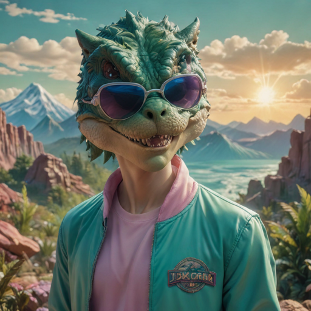
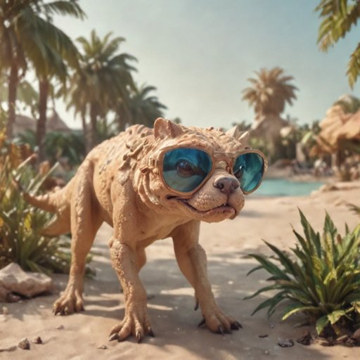

# Diffusion Evolver

This project is an evolutionary framework for optimizing Stable Diffusion XL models. It allows you to evolve a population of models through crossover, mutation, and selection based on their performance judged by a VLM.

## Examples


| Before Evolution | After Evolution |
|--------|------------------|-----------------|
|  |  |
|  |  |
|  |  |

After 10 cycles with prompt "T-Rex wearing aviator sunglasses, posing in front of a diffusion-generated Jurassic landscape, 80s vaporwave style, 4K"


## Installation

1. Clone the repository:
   ```
   git clone 
   ```

2. Install the required dependencies:
   ```
   pip install -r requirements.txt
   ```

3. Set up the necessary API credentials:
   - Obtain an API key from Anthropic.
   - Set the `ANTHROPIC_API_KEY` environment variable with your API key.

## Usage

To run the evolutionary framework, use the following command:

```
python sdxl-evolve.py model_list.yml [options]
```

The `model_list.yml` file should contain a list of initial model candidates in YAML format.

Available options:
- `-seed`: Random seed for reproducibility.
- `-cycles`: Number of evolutionary cycles to run (default: 10).
- `-elite`: Number of elite candidates to keep in each iteration (default: 10).
- `-parents`: Number of parents for each child (default: 2).
- `-population`: Size of the population (default: 50).
- `-mutation`: Chance of mutation (default: 0.05).
- `-output_path`: Directory to save the results (default: "evolve_output").
- `-eval_file`: Text file containing prompts for evaluation (default: "evals.txt").
- `-eval_samples`: Number of samples to evaluate between candidates (default: 3).
- `-vlm`: The VLM to use, claude(default) or llava
- `-append_prompt`: Adds to the end of eval prompts
- `-negative_prompt`: Negative prompt in diffusion sampling
- `-guidance_scale`: Guidance scale for diffusion sampling
- `-diffusion_steps`: Number of iterations to diffuse with the candidate during eval

## Documentation

The framework consists of the following main components:

- `evolve.py`: Defines the core evolutionary algorithm, including candidate representation, selection, crossover, mutation, and population management.
- `merge.py`: Provides functions for merging SafeTensor files to create new model candidates using DARE.
- `sdxl-evolve.py`: The main script that orchestrates the evolutionary process, including image generation, evaluation, and comparison using the VLM.

### Details

- `Candidate`: Represents a model candidate with its file path, initial population flag, p-value, and lambda value.
- `selection`: Selects a subset of candidates as parents for breeding.
- `mutation`: Applies random mutations to an offspring candidate.
- `breed`: Performs crossover and mutation to create a new offspring candidate.
- `evolve`: Evolves the population by selecting parents, breeding offspring, and updating the population.
- `run_evolution`: Runs the evolutionary process for a specified number of cycles.
- `load_candidates`: Loads initial model candidates from a YAML file.
- `write_yaml`: Writes the population to a YAML file.
- `generate_images`: Generates images using a Stable Diffusion XL pipeline for evaluation.
- `vlm_judge`: Uses the VLM to compare and judge the quality of generated images.

## References

- sakana.ai, Evolving New Foundation Models: Unleashing the Power of Automating Model Development: [https://sakana.ai/evolutionary-model-merge/](https://sakana.ai/evolutionary-model-merge/)
- DARE, Language Models are Super Mario: Absorbing Abilities from Homologous Models as a Free Lunch: [https://arxiv.org/pdf/2311.03099.pdf](https://arxiv.org/pdf/2311.03099.pdf)
- Stable Diffusion XL: [https://github.com/CompVis/stable-diffusion](https://github.com/CompVis/stable-diffusion)
- Anthropic API: [https://www.anthropic.com](https://www.anthropic.com)
- SafeTensors: [https://github.com/huggingface/safetensors](https://github.com/huggingface/safetensors)

Feel free to contribute, report issues, or suggest improvements!
